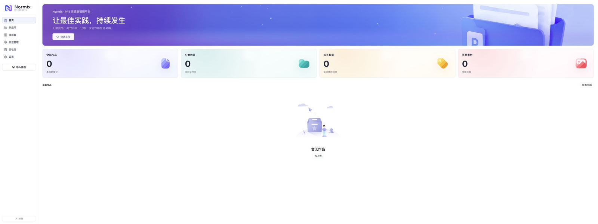
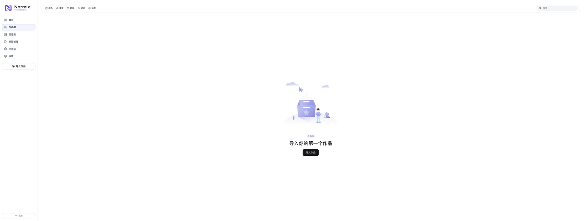
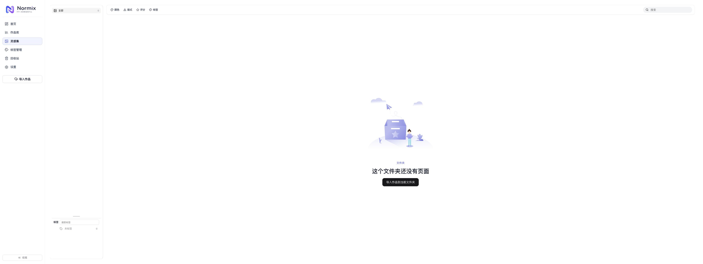
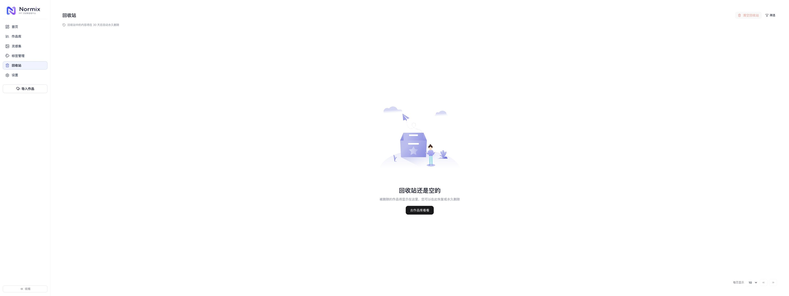
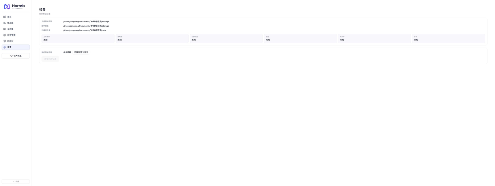

# Normix PPT 灵感集管理平台

<p align="center">
  
</p>

Normix 是一个开源的本地 PPT 灵感集管理平台，支持上传 PDF、图片集 PPT、ZIP 和常见图片，自动整理为页面图集，并提供了标签、文件夹、回收站、搜索、预览、复制和导出能力。数据默认保存在本机，不上传云端。

## 版本与平台

当前版本：`v1.0.1`

- macOS Apple Silicon（arm64）
- macOS Intel（x64）
- Windows 10 / 11 x64

## 功能

- 上传 PDF / PPTX / 图片集 PPT / ZIP / PNG / JPG / WEBP / GIF
- 自动将 PDF 和 PPTX 处理为页面图集
- PDF 优先使用系统 Poppler，缺失时自动使用 PDF.js 渲染
- 标签管理、分组、文件夹整理、回收站
- 页面预览、复制、导出 PDF / PPTX
- 动画 GIF 单次播放，避免循环闪烁
- 本地 SQLite 存储，适合个人和团队本地使用
- 桌面版自动启动内置服务，无需手动配置数据库

## 界面截图

### 首页



### 作品库



### 灵感集



### 标签管理


### 回收站



### 设置



## 下载安装

所有安装包都发布在 [GitHub Releases](https://github.com/congrongdesign/normix/releases) 页面。

### macOS

Apple Silicon 用户下载：

```text
Normix-1.0.1-mac-arm64.dmg
```

直接下载：[Normix-1.0.1-mac-arm64.dmg](https://github.com/congrongdesign/normix/releases/latest/download/Normix-1.0.1-mac-arm64.dmg)

Intel Mac 用户下载：

```text
Normix-1.0.1-mac-x64.dmg
```

直接下载：[Normix-1.0.1-mac-x64.dmg](https://github.com/congrongdesign/normix/releases/latest/download/Normix-1.0.1-mac-x64.dmg)

安装包未做 Apple 开发者签名，首次打开时请在 Finder 中右键应用，选择“打开”；如仍被阻止，可前往“系统设置 > 隐私与安全性”点击“仍要打开”。

### Windows

下载安装版：

```text
Normix-1.0.1-win-x64-setup.exe
```

直接下载：[Normix-1.0.1-win-x64-setup.exe](https://github.com/congrongdesign/normix/releases/latest/download/Normix-1.0.1-win-x64-setup.exe)

或下载免安装便携版：

```text
Normix-1.0.1-win-x64-portable.exe
```

直接下载：[Normix-1.0.1-win-x64-portable.exe](https://github.com/congrongdesign/normix/releases/latest/download/Normix-1.0.1-win-x64-portable.exe)

如果出现 SmartScreen 提示，请选择“更多信息 > 仍要运行”。安装版支持自定义安装目录，并可创建桌面和开始菜单快捷方式。

如果旧版 Windows 安装包启动时提示 `Could not load the "sharp" module`，请重新下载当前 `v1.0.1` 安装包，新版已包含 Windows 原生模块。

### macOS 提示“已损坏，无法打开”

当前 macOS 安装包未做 Apple Developer 签名，因此从 Chrome 或其他浏览器下载后，系统可能提示“Normix 已损坏，无法打开”。这是 Gatekeeper 隔离标记导致的，不是安装包损坏。

先右键 `Normix.app`，选择“打开”，再点击一次“打开”。如果仍然报错，打开“终端”执行：

```bash
xattr -dr com.apple.quarantine "/Applications/Normix.app"
open "/Applications/Normix.app"
```

如果应用安装在其他位置，把命令中的 `/Applications/Normix.app` 替换为实际路径即可。

### 校验文件完整性

下载 [SHA256SUMS.txt](https://github.com/congrongdesign/normix/releases/latest/download/SHA256SUMS.txt) 后，在下载目录执行：

```bash
shasum -a 256 -c SHA256SUMS.txt
```

## 从源码运行

环境要求：

- Node.js 20 或更高版本
- npm 10 或更高版本

```bash
npm ci
npm run dev
```

前端默认运行在 `http://localhost:5173/`，API 默认运行在 `http://localhost:4000/`。

## 从源码构建桌面版

```bash
npm ci
npm run build
npm run desktop:dev
```

构建安装包：

```bash
npm run package:mac
npm run package:win
npm run package:mac:arm64
npm run package:mac:x64
```

如果下载 Electron 或 DMG 工具超时，可以使用国内镜像：

```bash
export ELECTRON_MIRROR=https://npmmirror.com/mirrors/electron/
export ELECTRON_BUILDER_BINARIES_MIRROR=https://npmmirror.com/mirrors/electron-builder-binaries/
npm run package:mac
```

## 数据存储

桌面版数据位于：

- macOS：`~/Library/Application Support/Normix`
- Windows：`%APPDATA%\Normix`

开发模式数据位于当前项目的 `data/` 和 `storage/`，这些目录默认不进入 Git。

从开发模式迁移到桌面版：

```bash
npm run migrate:desktop
```

该命令会把现有 `data/` 和 `storage/` 复制到桌面版数据目录，不会覆盖已有桌面数据。

## 发布新版本

1. 更新 `package.json` 中的 `version`
2. 构建安装包
3. 运行发布脚本：

```bash
npm run publish:github
```

脚本会自动推送代码和标签，并把 `release/` 下的安装包上传到 GitHub Release。发布令牌保存在 macOS 钥匙串中，脚本会自动读取。

## 项目结构

```text
src/                 React 前端
server.mjs           Express + SQLite 服务
lib/                 PDF、PPTX、图片等处理逻辑
electron/            Electron 桌面壳
scripts/             构建、迁移、发布脚本
build/               Mac/Windows 安装包图标
docs/screenshots/    文档截图
release/             本地构建产物
```

## 技术栈

- React
- Vite
- Express
- SQLite
- Electron
- Sharp
- JSZip
- pdfjs-dist
- @napi-rs/canvas
- Poppler（可选系统加速）

## 参与贡献

欢迎提交 Issue、Pull Request 或改进文档。请先阅读 [CONTRIBUTING.md](CONTRIBUTING.md) 和 [CODE_OF_CONDUCT.md](CODE_OF_CONDUCT.md)。

## 安全

如发现安全问题，请阅读 [SECURITY.md](SECURITY.md)，不要直接在公开 Issue 中提交敏感信息。

## 开源协议

本项目使用 [MIT License](LICENSE)。
